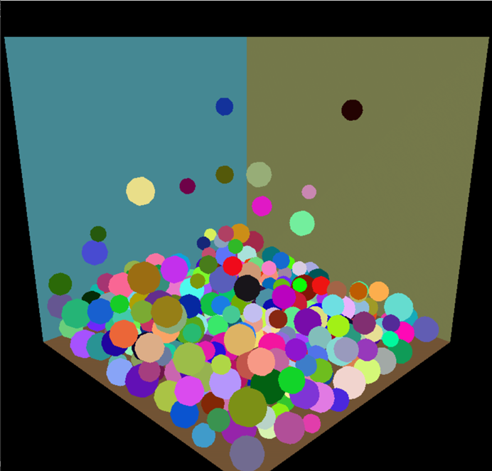

# Ball-Collision-Cuda-Accelerating 基于GPU的碰撞检测

## 程序运行环境及编程环境

操作系统: Windows10

CPU: Intel Core i7-7500U 2.70GHz 双核4逻辑处理器

GPU: NVIDIA GeForce 940MX

编程环境: Visual Studio2019 CUDA 10.1 Runtime Project

使用GLUT opengl库

Release x64模式

## 各个程序模块之间的逻辑关系

### 头文件: 
sphere.cuh定义了小球数据结构

util_vectors.cuh定义了Vec3f数据结构

### 源文件glcuda.cu:
main函数：程序入口，完成opengl初始化，建立窗口。main函数调用initScene函数完成小球的初始化和共享内存的分配，每帧调用myDisplay绘制动画。

myDisplay函数：每一帧的碰撞检测和绘制

myDisplay函数调用sphereGridIndex核函数完成空间划分，调用sphereGridCollision核函数完成碰撞检测，调用sphereMove核函数完成小球移动。最后调用drawSphere函数绘制所有小球。

## 程序运行的主要流程

程序运行开始首先进行内存分配，建立窗口等初始化工作。同时为每个小球设置随机的速度，大小，质量等指标。

在程序运行的每一帧，程序首先进行共享内存的同步，然后调用sphereGridIndex, sphereGridCollision, sphereMove三个核函数进行空间划分，碰撞检测和小球移动。最后使用opengl绘制场景，完成显示。

sphereGridIndex核函数每个线程处理一个小球，将空间划分为与最大球直径相同大小的网格，使用原子操作atomicAdd将小球位置的gridContainSphereNumber加一，并根据atomicAdd返回值将小球索引放入共享内存gridContainSphereIndex的对应位置（保证不会冲突）。

sphereGridCollision核函数每个线程处理一个小球，对小球所在网格周围的27个网格内的其他小球进行碰撞检测，同时只检测编号比自身大的小球（这保证了两球碰撞时只检测一遍，同时避免写入冲突）。如若发生碰撞，将自身小球和碰撞小球的速度进行相应修改。

sphereMove每个线程处理一个小球，将小球的位置值自加速度值，实现小球位置的更新。

程序使用glut opengl库生成GUI动画。

## 各个功能的演示方法

在bin文件夹下，双击glcuda.exe可执行程序，在有cuda环境下的Win10电脑上（我电脑的cuda版本为10.1），场景内的小球会自动开始运动和碰撞检测，用户不需要额外输入。

程序截图如下：

## 测试及算法性能的分析

在NVIDIA GeForce 940MX GPU上运行程序，该显卡能力较差。

调整场景内小球的数目，测量每秒渲染帧数(fps)如下：

| 场景内小球数 |	64球 |	192球 |	320球 |	512球 |
| ----------- | ----------- | ----------- | ----------- | ----------- |
| 每秒帧数(fps)	| 60.2帧 |	60.1帧 |	60.1帧 |	59.8帧 |

### 测量结果分析

由上述测量结果，可以发现在GPU上运行程序时，每秒帧数(fps)达到了较高的水平，且几乎不随场景内小球数量而变化。分析可知该程序在GPU上达到了较高的并行水平，每个小球一个线程，实现了较高的性能。

## 算法复杂度分析
我的算法使用了空间划分的数据结构，每一帧的计算复杂度为O(n log n)，由于在GPU上实现了每个小球一个线程，所以计算效率很高。
## 实验总结
经过本次实验，我对cuda编程有了初步的接触。我实现的代码运行效率较高，鲁棒性较好，较为完善。感谢徐老师和助教耐心的指导和帮助！

## 参考文献和引用代码出处
cuda学习参考了https://zhuanlan.zhihu.com/p/34587739教程。

空间划分和碰撞检测部分参考了
https://developer.nvidia.com/gpugems/gpugems3/part-v-physics-simulation/chapter-32-broad-phase-collision-detection-cuda教程。

glut教程及部分模板代码参考了
https://www.cnblogs.com/yangxi/category/322690.html教程。

util_vectors.h 头文件定义了 Vec3 (3元素vector) 类，参考了之前找的网上资料修改得到。

opengl绘制球体的部分参考了博客https://www.xuebuyuan.com/508980.html 

